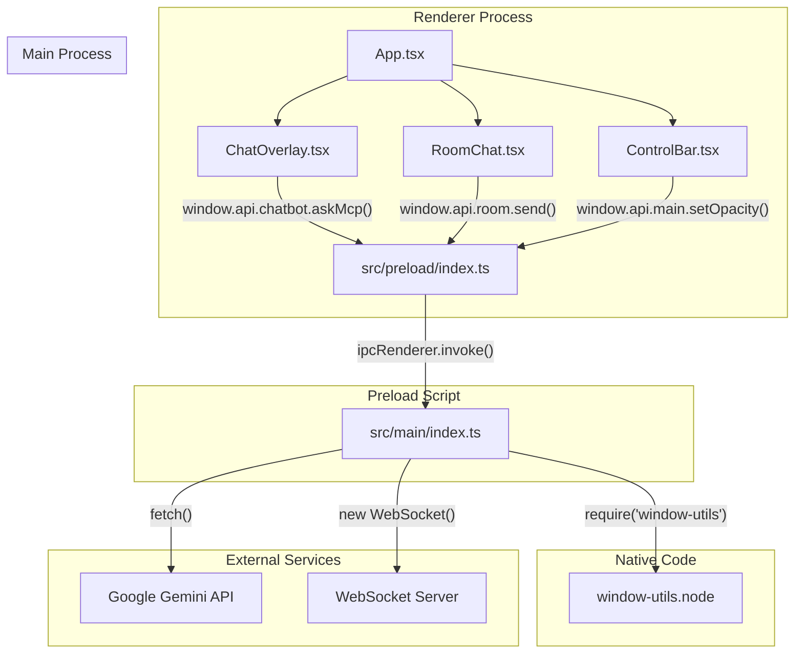

# PROJECT_CONTEXT.md

## 1. Architecture

The project follows a standard **Electron application architecture**, which is divided into three main parts:

1.  **Main Process**: The entry point of the application, responsible for creating and managing windows, handling native OS interactions (like tray icons and global shortcuts), and running backend logic. It's the only process with full Node.js API access.
2.  **Renderer Process**: The user interface of the application, running in a separate process. It's essentially a web page (built with **React** and **Vite**) that gets loaded into an Electron browser window.
3.  **Preload Script**: A script that runs in a privileged context before the renderer process's web page is loaded. It acts as a secure bridge, exposing specific Node.js/Electron APIs from the main process to the renderer process via the `contextBridge`.

This project does not use a formal high-level architectural pattern like MVC or Clean Architecture but adheres to the process separation model inherent to Electron.

## 2. Modules

### a. Main Process (`src/main`)

-   **Purpose**: Core application logic, window management, and backend operations.
-   **Main Files**:
    -   `index.ts`: The primary entry point. It handles app lifecycle events, creates the main `BrowserWindow`, sets up global shortcuts, creates the tray icon, and manages all IPC (Inter-Process Communication) handlers.
    -   `config.ts`: Loads and exports configuration variables (like API keys and WebSocket URLs) from environment variables (`.env` file).
-   **Dependencies**: `electron`, `@electron-toolkit/utils`, `node-fetch` (for Gemini API), `ws` (for WebSocket), and the local `window-utils` native addon.

### b. Preload Script (`src/preload`)

-   **Purpose**: To securely expose a well-defined API from the main process to the renderer process.
-   **Main Files**:
    -   `index.ts`: Uses `contextBridge.exposeInMainWorld` to create a `window.api` object that the renderer can call. This object contains functions that trigger IPC events.
    -   `index.d.ts`: Provides TypeScript definitions for the exposed `window.api` object, enabling type-safe calls from the renderer.
-   **Dependencies**: `electron`.

### c. Renderer Process (`src/renderer`)

-   **Purpose**: To render the user interface and handle user interactions.
-   **Main Files**:
    -   `main.tsx`: The entry point for the React application.
    -   `App.tsx`: The root React component, which manages the application's state (like opacity, mode, etc.) and renders the main UI components.
    -   `components/`: Contains all the React components:
        -   `ControlBar.tsx`: The main control panel for adjusting opacity, toggling modes, and accessing settings.
        -   `overlay.tsx` (`ChatOverlay`): The chat interface for the LLM mode.
        -   `RoomChat.tsx`: The chat interface for the WebSocket-based room mode.
-   **Dependencies**: `react`, `react-dom`, `react-markdown`.

### d. Native Addon (`native-addon/window-utils`)

-   **Purpose**: To provide access to native Windows OS functionality that is not available in Electron's standard API.
-   **Main Files**:
    -   `src/window-utils.cc`: The C++ source code that uses the Windows API (`SetWindowDisplayAffinity`) to hide the application window from screen captures.
    -   `index.js`: The JavaScript wrapper that loads the compiled native addon (`.node` file) and exposes its functions to the rest of the Node.js application (specifically, the main process).
-   **Dependencies**: `node-addon-api`, `cmake-js`/`node-gyp` (for building).

## 3. Entry Points

-   **Application Entry Point**: `src/main/index.ts` is the main entry point specified in `package.json`.
-   **UI Entry Point**: `src/renderer/src/main.tsx` renders the main React `App` component into `src/renderer/index.html`.
-   **API Routes / IPC Handlers**: The main process (`src/main/index.ts`) defines numerous IPC handlers that serve as the "API" for the renderer process. Key handlers include:
    -   `chatbot:ask-mcp`: Sends a prompt to the Gemini LLM.
    -   `chatbot:set-model`, `chatbot:get-model`: Manages the Gemini model version.
    -   `chatbot:set-api-key`, `chatbot:get-api-key`: Manages the user's API key.
    -   `room:*`: A set of handlers for connecting, disconnecting, and sending messages via WebSocket.
    -   `main:*` and `overlay:*`: Handlers for controlling window properties like opacity, size, and click-through state.
    -   `main:hide-from-capture`, `main:show-in-capture`: Triggers the native addon to control screen capture visibility.

## 4. Data Layer

The application does not use a traditional database. Data is persisted in a few different ways:

-   **API Key**: The user's Gemini API key is stored in a JSON file (`api-key.json`) within the application's user data directory (`app.getPath('userData')`). This provides persistence across sessions.
-   **System Prompts**: Custom system prompts are saved to the browser's `localStorage`.
-   **Configuration**: Default configuration (like the WebSocket URL) is managed in `src/main/config.ts` and can be overridden by environment variables.
-   **In-Memory**: Conversation history for the LLM chat is stored in memory and is reset when the application is reloaded.

## 5. Dependencies Graph

## 6. Business Logic / Core Workflows

### a. LLM Chat Workflow

1.  The user types a message or attaches an image in the `ChatOverlay` component (UI).
2.  The component calls `window.api.chatbot.askMcp(payload)` via the preload script.
3.  The `ipcMain.handle('chatbot:ask-mcp', ...)` handler in the main process receives the request.
4.  The main process retrieves the user's API key (or the one from config).
5.  It constructs a request (including conversation history and any images) and sends it to the **Google Gemini API** using `node-fetch`.
6.  Upon receiving a response, the main process extracts the text and sends it back to the renderer.
7.  The `ChatOverlay` component receives the answer and updates the UI to display the bot's message.

### b. Room Chat Workflow

1.  The user enters a nickname and clicks "Connect to Server" in the `RoomChat` component.
2.  This triggers the `room:connect` IPC handler in the main process.
3.  The main process establishes a persistent **WebSocket connection** to the URL specified in the config.
4.  The user can then create a new room or join an existing one by providing a room key.
5.  When sending a message, the `RoomChat` component calls the `room:send` IPC handler.
6.  The main process forwards the message over the active WebSocket.
7.  When a message is received from the WebSocket, the main process forwards it to the renderer via the `room:message` channel, and the `RoomChat` component updates the UI.

### c. Screen Capture Protection (Windows Only)

1.  When the main window is created (`createWindow()` in `src/main/index.ts`), a call is made to `hideWindowFromCapture(mainWindow)`.
2.  This function gets the native window handle (`getNativeWindowHandle()`).
3.  It then calls `windowUtils.hideFromCapture(handle)`, which is a function exposed by the C++ native addon.
4.  The C++ code executes `SetWindowDisplayAffinity(hwnd, WDA_EXCLUDEFROMCAPTURE)`, a Windows API function that tells the OS to exclude this window from screen sharing and recording.
5.  The user can toggle this feature from the `ControlBar`, which triggers IPC handlers (`main:hide-from-capture`, `main:show-in-capture`) to call the corresponding functions in the native addon.
